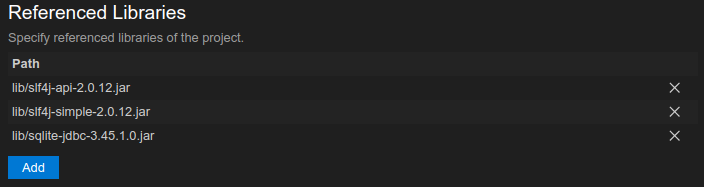

# Cadastro e reserva de biblioteca

Projeto desenvolvido como atividade qualitativa sobre JDBC para a disciplina Desenvolvimento de aplicações corporativas.

## Instalando o driver JDBC para o SQLite

Faça [download do .jar do driver](https://mvnrepository.com/artifact/org.xerial/sqlite-jdbc/3.45.1.0) e adicione junto com as bilbiotecas em `lib` ao classpath como na seguinte imagem.

